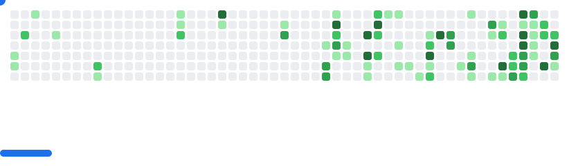

  

<h1 align="center">Hi 👋, I'm Shanavas V Basheer</h1>

<h3 align="center">A passionate developer from India</h3>

- 🔭 I’m currently studying on **Cusat**  
- 📫 How to reach me **shanavasvbasheer@gmail.com**  

---

<h3 align="center">🎮 My GitHub Breakout</h3>

  <picture>
    <source media="(prefers-color-scheme: dark)" srcset="images/breakout-dark.svg" />
    <source media="(prefers-color-scheme: light)" srcset="images/breakout-light.svg" />
    
  </picture>

---

<h3 align="left">Connect with me:</h3>

<h3 align="left">Languages and Tools:</h3>

 
 
 
 

